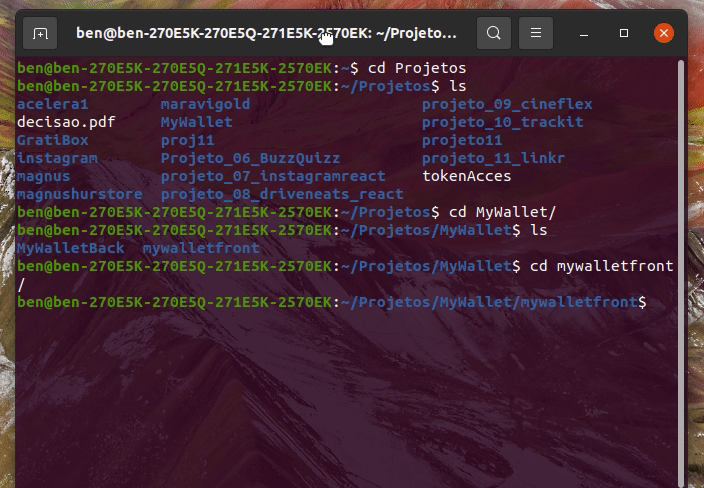
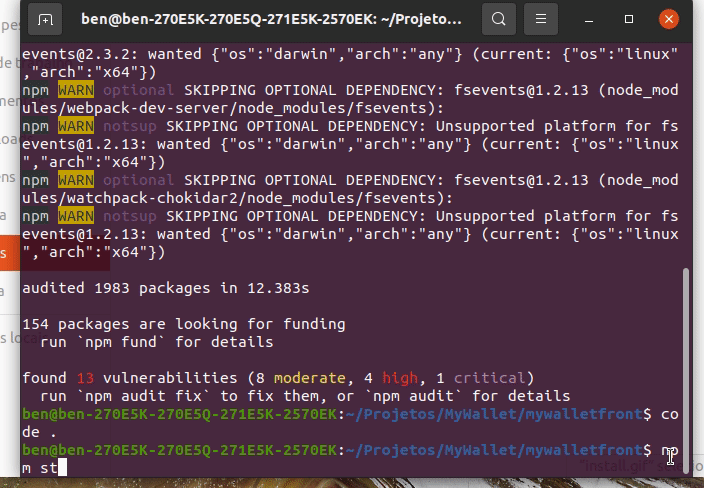

# MYWALLET

### Primeiro você precisa instalar as dependências do projeto com o comando npm install

### Agora basta rodar a aplicação com npm start

### Porém, antes de usar a aplicação, siga as instruções do backend do projeto em: 
### https://github.com/benhurfaria/mywalletback